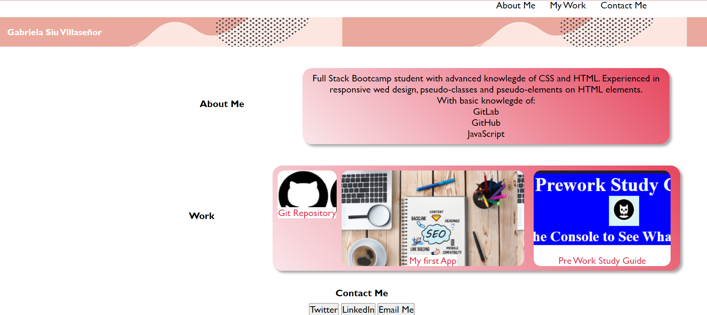

# My first Portafolio 
## Description 

My first Portafolio is an interactive website where future's employers
would be able to see my work from my very first website and 
see the evolution of my work and skills.
On this website, employers will be able to see flexbox, background images,
screen media queries, buttons and more.
Also, the styling of containers, UI scrolls and others skills on HTML and CSS. 
You can see my deployed website ---> https://gabrielasiu.github.io/Challenge-2/ 

